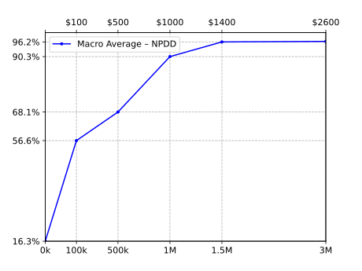

To plot the Copycat performances on Analysis of API Attack, run the code:
  
 ```console
 $ ./Plot_Copycat_Performances.py Copycat_Results_on_Azure.csv
 ```

 Files:
 * [Plot_Copycat_Performances.py](Plot_Copycat_Performances.py)
 * [Copycat_Results_on_Azure.csv](Copycat_Results_on_Azure.csv)<br>
   _note_: the performance presented in this file is calculated by dividing the Macro Average of the Copycats:
   * [vgg_NPDD-SL-0k/results.txt](vgg_NPDD-SL-0k/results.txt)
   * [vgg_NPDD-SL-0.1/results.txt](vgg_NPDD-SL-0.1/results.txt)
   * [vgg_NPDD-SL-0.5/results.txt](vgg_NPDD-SL-0.5/results.txt)
   * [vgg_NPDD-SL-1.0/results.txt](vgg_NPDD-SL-1.0/results.txt)
   * [vgg_NPDD-SL-1.5/results.txt](vgg_NPDD-SL-1.5/results.txt)
   * [vgg_NPDD-SL-3.0/results.txt](vgg_NPDD-SL-3.0/results.txt)
   
   by the Macro Average of the API (0.350943).<br>
   The dataset used to calculate the Macro Average is [FER7 TDD](../../data/FER7/TD.txt.7z).<br>
   More details in [Copycat_Results_on_Azure.ods](Copycat_Results_on_Azure.ods)
* **[Answers obtained from Emotion API](https://drive.google.com/drive/folders/1vrIjohM2mtwHT1gpj6LDScg0B-tD8UJ1?usp=sharing)**


<br>*Performance of Copycats over Azure API on different sizes of NPDD subsets.*
<br>*The x-axis shows the subset size (bottom) and the pricing for generating these stolen labels (top).*
