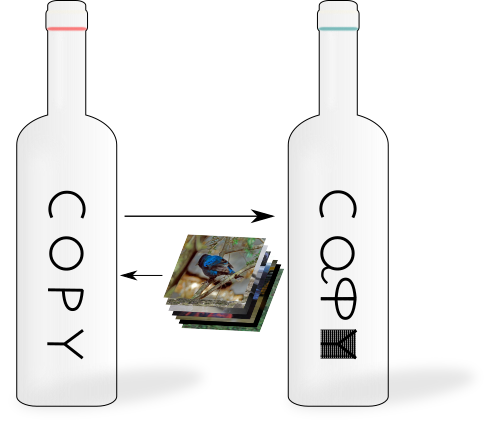

<p align="center">
  
  
  <h2 align="center">Copycat CNN</h2>
  <h3>Your answer is my key to gain knowledge!</h3>
</p>

#### Are your model safe or can I _Copycat_ it?

In the past few years, Convolutional Neural Networks (CNNs) have been achieving state-of-the-art performance on a variety of problems.
Many companies employ resources and money to generate these models and provide them to users around the world, therefore it is in their best interest to protect them, i.e., to avoid that someone else copy them.
Several studies revealed that state-of-the-art CNNs are vulnerable to adversarial examples attacks, and this weakness indicates that CNNs do not need to operate in the problem domain.
Therefore, we hypothesize that they also do not need to be trained with examples of the Problem Domain in order to operate in it.

[Our research](https://github.com/jeiks/Stealing_DL_Models) presented a simple method to attack a model and steal its knowledge. And the experiments presented high accuracies, showing that is possible to copy a black-box model.
The process uses only Random Natural Images (ImageNet and Microsoft COCO) labeled (hard-label) by target model.
The main difference between our work and others is that we only use the hard-labels, i.e., it is not necessary to know the probabilities of the target model, only the classification label for each image.

Our first experiments were developed using [Caffe Framework](https://caffe.berkeleyvision.org/), but to be easy to you, here we provide an example of usage implemented in PyTorch to you test and apply _Copycat_.

### How to apply Copycat
First of all, download this folder from GitHub. To avoid downloading the whole repository, try this trick with subversion:
```sh
$ sudo apt-get install subversion
$ mkdir $HOME/Copycat
$ cd $HOME/Copycat
$ svn co https://github.com/jeiks/Stealing_DL_Models/trunk/Framework
```

Now, install the requeriments (it is a good option to use a virtual environment):
```sh
$ cd $HOME/Copycat/Framework
$ virtualenv --python=python3.6 $HOME/Copycat/virtenv
$ source $HOME/Copycat/virtenv/bin/activate
$ pip install -r requeriments.txt
```

On this example, we are using the [CIFAR10](https://www.cs.toronto.edu/~kriz/cifar.html) as [dataset](./oracle/cifar_data.py) and a simple [model](./oracle/model.py). <br>
But feel free to change the code and test other dataset and model. <br>
The same model structure is being used to [Oracle](./oracle/model.py) and for [Copycat](./copycat/model.py), but it is not necessary. <br>
But to avoid constraints caused by the model structure (for example, a smaller model may not be able to copy a larger one), you must use the same model structure for both networks.

Well, the code now is simple to use.<br>
First, we have to train the Oracle (it will be _target model_):
```sh
$ # Training:
$ python oracle/train.py cifar_model.pth
$ # Testing:
$ python oracle/test.py cifar_model.pth
```
The file `cifar_model.pth` will be created and will be our _target model_.

Now, it is time to extract the labels from our _target model_.<br>
Download the [ImageNet](http://www.image-net.org/) images and, if you want, [Microsoft COCO](https://cocodataset.org) images.<br>
Our tests used 3M images, but feel free to test with more or less images.

After download the images and place them on a directory, you have to create a _txt_ file with their location.<br>
It is easy to make by using this command:
```sh
$ cd $HOME/Copycat/Framework
$ find DIRECTORY_WHERE_YOU_DOWNLOADED_THE_IMAGES -type f | grep -i 'jpg\|jpeg\|png' > images.txt
```

With the images, we are ready to extract the labels from _target model_:
```sh
$ python copycat/label_data.py cifar_model.pth images.txt stolen_labels.txt
$ # If you need to change the batch size, inform it as an additional parameter.
$ # Example for batch_size=64:
$ python copycat/label_data.py cifar_model.pth images.txt stolen_labels.txt 64
```
The file stolen_labels.txt will be created and now we can train our Copycat network.<br>
If the process provided some error processing some image, remove the image filename from images.txt and try again.

Finally, we can create our Copycat model and test it:
```sh
$ # Training:
$ python copycat/train.py copycat.pth stolen_labels.txt
$ # Testing:
$ python oracle/test.py copycat.pth
```

The Macro Average can be used to compare the quality of the attack.
