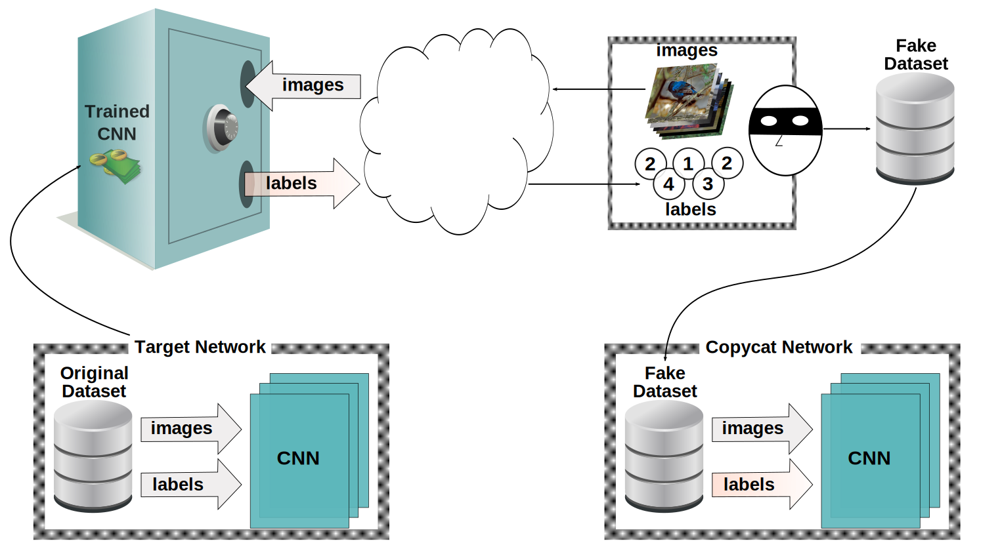

# Copycat CNN: Stealing Knowledge by Persuading Confession with Random Non-Labeled Data

In the past few years, Convolutional Neural Networks (CNNs) have been achieving state-of-the-art performance on a variety of problems. Many companies employ resources and money to generate these models and provide them as an API, therefore it is in their best interest to protect them, i.e., to avoid that someone else copy them. Recent studies revealed that state-of-the-art CNNs are vulnerable to adversarial examples attacks, and this weakness indicates that CNNs do not need to operate in the problem domain (PD). Therefore, we hypothesize that they also do not need to be trained with examples of the PD in order to operate in it.

Given these facts, in this paper, we investigate if a target black-box CNN can be copied by persuading it to confess its knowledge through random non-labeled data. The copy is two-fold: *i)* the target network is queried with random data and its predictions are used to create a fake dataset with the knowledge of the network; and *ii)* a copycat network is trained with the fake dataset and should be able to achieve similar performance as the target network.

This hypothesis was evaluated locally in three problems (facial expression, object, and crosswalk classification) and against a cloud-based API. In the copy attacks, images from both non-problem domain and PD were used. All copycat networks achieved at least $93.7\%$ of the performance of the original models with non-problem domain data, and at least $98.6\%$ using additional data from the PD. Additionally, the copycat CNN successfully copied at least $97.3\%$ of the performance of the Microsoft Azure Emotion API. Our results show that it is possible to create a copycat CNN by simply querying a target network as black-box with random non-labeled data.

||
:--------------:
|**On the left, the target network is trained with an original (confidential) dataset and is served publicly as an API, receiving images as input and providing class labels as output. On the right, it is presented the process to get stolen labels and to create a fake dataset: random natural images are sent to the API and the labels are obtained. After that, the copycat network is trained using this fake dataset.**|

## Datasets Contents
The images were obtained from public datasets. But they require a registration before download. 

Here we present the contents necessary to create a equivalent dataset after download the images from their original source.

Problems:
- [FER](Dataset-Contents/FER).
- [OBJ](Dataset-Contents/OBJ). 
- [Crosswalk](Dataset-Contents/Crosswalk). 
- [MSAPI (Azure)](Dataset-Contents/Azure).

## Networks
All networks were generated with caffe. The weights (caffemodel) and solverstates were compacted using 7zip.

Problems:
- [FER](Networks/FER).
- [OBJ](Networks/OBJ). 
- [Crosswalk](Networks/Crosswalk). 
- [MSAPI (Azure)](Networks/Azure).
