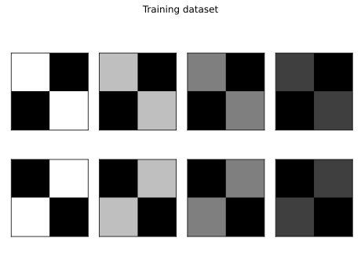
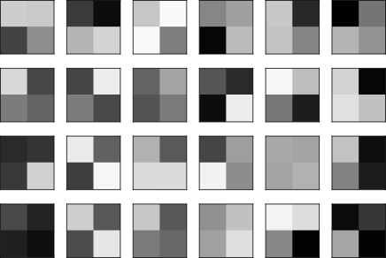
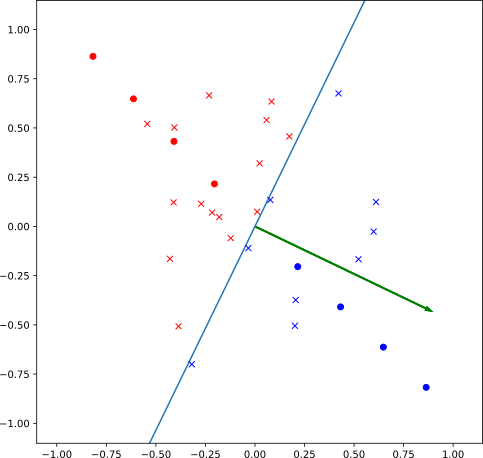
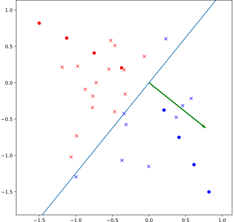

### Simple example of the Copycat Method

It uses a simple architecture:


that represents a linear model, where the Feature Map is also the Classification Space.

The Oracle can use a small training dataset:



be trained and find the good parameters, convolutional kernel (**k=(k1 k2)**) values and weights (**w=(w1 w2)**), to represent and classify this data.

After, some pixel-wise samples can be generated to extract the Oracle's labels:



And the Copycat network can be trained with this fake dataset (random images labeled by the Oracle).

After training, the Copycat model is expected to also correctly represent the problem domain data used to train Oracle.

As it is a simple linear model, its feature map, classification space, unit vector of weights ($\hat{\mathbf{w}} = {\mathbf{w}}/{||\mathbf{w}||}$), and the decision boundary can be presented in a graphic.

The Oracle and the Copycat graphic are respectively:

<div>    </div>

The circles are the features of the training images with their original labels and the crosses are the features of the random images labeled by Oracle, where each color represents a different class.
The red color is used to represent class one, which is labeled $-1$, so it must be below the decision boundary.
And the blue color is class two, labeled $+1$, which must be above the decision threshold.

### Running this experiment

If you want to run this experiment, follow these steps:

1. Download the [copycat.py](copycat.py) file.
2. Install the Python packages:
  ```sh
  pip install torch numpy matplotlib Pillow
  ```
3. And run the script:
  ```sh
  python copycat.py
  ```
